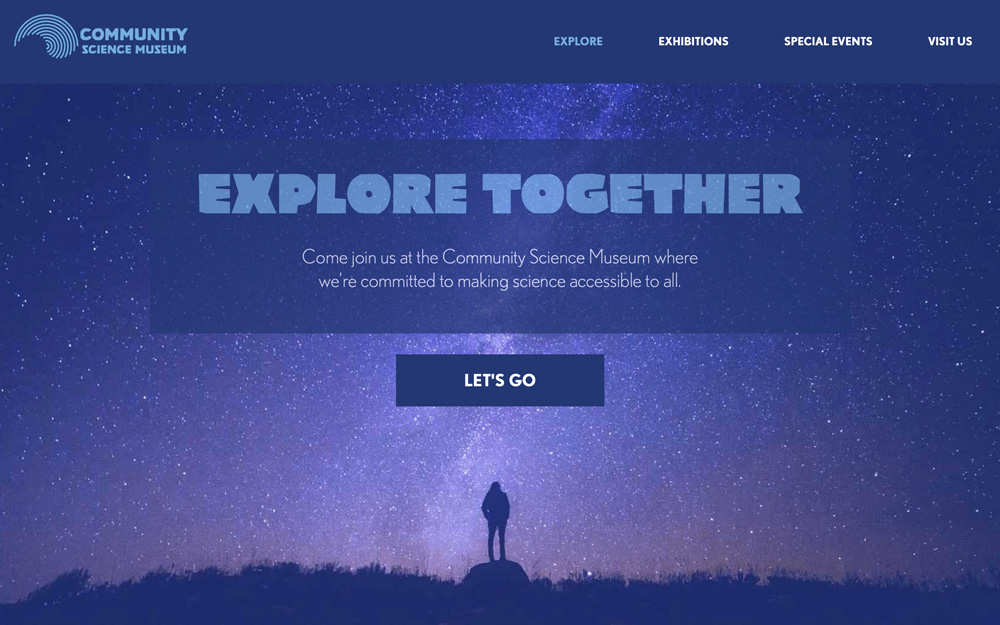

# Community Science Museum

An interactive science museum called **Community Science Museum** is opening in the ficticious city of Oslotlantis. Developing a website for this immaginary museum was my first project as a front-end development student at the Norwegian School of Technology and Digital Media (Noroff).

## Description

Playful rather than serious. Simple rather than complex. These were the basic premises that guided me in the conceptualisation of the Community Science Museum website. From the colour palette to the typographic choices, from the selection of the images to the navigation structure of the project, the choices that I have made reflect a well-defined goal: develop something that is functionally simple and aesthetically appealing to young target audiences.

- Target audience: primary and middle school children (7-15) and families with young children;
- The site should appeal to youngsters without pandering;
- It should take for granted that the audience is inquisitive and intelligent;
- The website should be responsive and be easy to use on a variety of devices.

This project should reflect the student's creative and technical knowledge and skills based on the first semester curriculum. This includes:

- Design principles;
- Project management;
- Communication technology;
- Developing with HTML/CSS.

## Built with

- Adobe XD
- HTML
- CSS

## Links

- PRODUCT | [Link to the website deployed via Netlify](https://cranky-wing-1d6bb5.netlify.app/index.html)
- [Mid-fidelity web prototype](https://xd.adobe.com/view/b08399c0-a725-4348-ac92-9de243d70591-e5d0/);
- [Low-fidelity mobile prototype](https://xd.adobe.com/view/5ea1f10f-8843-4eb2-893d-083f197a63ee-0bf2/);
- [Gantt chart](https://app.instagantt.com/shared/61be4727d4b9055cb29e34dd);
- [Full report](https://shared-assets.adobe.com/link/e01001d4-0f56-4825-7ed8-391135a7e4d7).

## Grade & Feedback from instructor

**Grade:** A

**Grading Criteria**

- Can apply vocational knowledge to practical problems in web development with emphasis on design process, aesthetics and the use of HTML and CSS;
- Can apply vocational knowledge to practical problems in web development with emphasis on design process, aesthetics and the use of HTML and CSS;
- Masters industry-relevant tools, techniques and expressions in design process and development of websites in accordance with regulations and guidelines for universal design;
- Can study and document his/her own work processes and identify design related issues and what measures needs to be implemented.

**Appealing design:** 2,75 / 3

_Feedback from instructor: The site looks great. Fonts and colors well chosen. Easy to navigate site. Ideally, projects are delivered as though they’re ready to go live for a client._

**Technically efficient:** 4 / 4

_Feedback from instructor: HTML is neat, bug-free and semantic. CSS is organised and follows DRY principles. No issues on the technical side._

**WCAG guidelines, content management and SEO:** 2 / 2

_Feedback from instructor: The blue text on the blue background is AA but not AAA compliant. Good if you can get AAA compliance but no points deduction._

**Report:** 1 / 1

_Feedback from instructor: Well thought through report. Nice to read the student’s holistic thinking including topics like ED&I. Very little to fault in the project._

## Contributing

Feel free to suggest improvements and open a pull request if you want to get involved in this project.

## License

- Copyright (c) 2022 Henri Kugler
- [MIT License](/LICENSE)

## Contact

- [My LinkedIn page](https://www.linkedin.com/in/henri-kugler-78218422b/)
- My personal portfolio (under construction)

## Acknowledgments

All pictures are royalty-free and have been taken from [Unsplash](https://unsplash.com).
